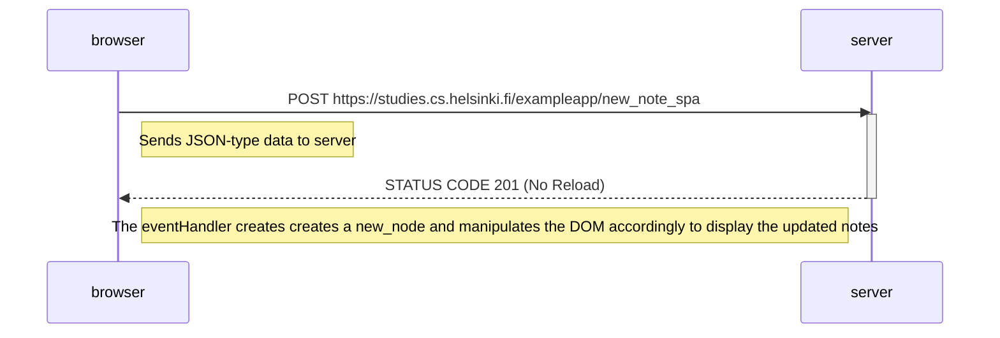

# Sequence Diagram for adding new-note in SPA

```mermaid
sequenceDiagram
    participant browser
    participant server

    browser->>server: POST https://studies.cs.helsinki.fi/exampleapp/new_note_spa
    activate server
    Note right of browser: Sends JSON-type data to server
    server-->>browser: STATUS CODE 201 (No Reload)
    deactivate server

    Note right of browser: The eventHandler creates creates a new_node and manipulates the DOM accordingly to display the updated notes
```
